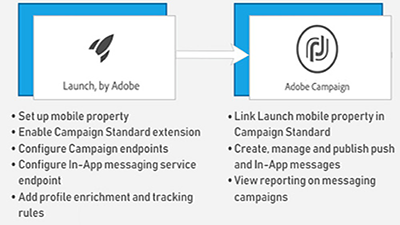

# 概觀

Adobe Campaign 為跨通路客戶體驗的設計提供了平台，並為可視性行銷活動的策劃、即時互動管理和跨通路執行提供了環境。本使用指南包含有關Adobe Campaign Standard許多功能的影片和教學課程。

## 新增功能

* **[外部API活動](/help/managing-processes-and-data/data-management-activities/external-api-activity.md)**    
   *瞭解如何使用外部API活動來設定及執行工作流程。*

* **[描述檔替代——使用目標描述檔測試電子郵件訊息](/help/communication-channels/email/profile-substitution.md)**    
   *瞭解如何以描述檔將會收到的確切訊息來傳送檢閱證明。*

* **[控制面板- Google TXT記錄管理](/help/administrating/control-panel/google-txt-record-management.md)**    
   *瞭解如何將Google TXT網站驗證記錄新增至您所有透過「促銷活動控制面板」傳送電子郵件至GMAIL位址的子網域。*

* **[教學課程： Android推播通知快速入門](https://docs.adobe.com/content/help/en/campaign-standard-learn/getting-started-with-push-notifications-android/introduction.html)**    
   *本教學課程會逐步帶您瞭解從Adobe Campaign傳送推播通知以及在Android應用程式中接收這些通知的相關步驟。*

## 員工挑選

<table>
<tr>
  <td>
    
    

      <a href="./communication-channels/mobile/in-app/in-app-message-overview.md">
    <strong>應用程式內訊息（教學課程）</strong>
    </a>
    

    

    <em>「應用程式內訊息」是一個渠道，可讓您在使用者在行動應用程式中處於作用中時顯示訊息。</em>
    

  </td>
   <td>
    
    

      <a href="./designing-content/email-designer/email-designer-overview.md">
    <strong>電子郵件設計人員（視訊）</strong>
    </a>
    

    

    <em>電子郵件設計工具可讓您快速輕鬆地建立個人化電子郵件。</em>
    

  </td>
  <td>
    
    

      <a href="./designing-content/product-listings-in-transactional-email.md">
    <strong>產品清單（教學課程）</strong>
    </a>
    

    

    <em>使用產品和產品清單建立交易電子郵件。 </em>
    

  </td>
</tr>
</table>

## 其他資源

* [檔案](https://docs.adobe.com/content/help/en/campaign-standard/using/campaign-standard-home.html)
