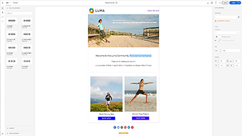

# 概觀

Adobe Campaign 為跨通路客戶體驗的設計提供了平台，並為可視性行銷活動的策劃、即時互動管理和跨通路執行提供了環境。本使用指南包含有關Adobe Campaign Standard許多功能的影片和教學課程。

## 新增功能

* **[控制面板——產生和安裝GPG金鑰](/help/administrating/control-panel/generating-and-installing-gpg-keys.md)**

   *瞭解如何在指定的例項上產生和安裝新的公開／私有GPG金鑰對，以及如何匯入和安裝公開金鑰至您的Adobe Campaign例項。*

* **[外部API活動](/help/managing-processes-and-data/data-management-activities/external-api-activity.md)**

   *瞭解如何使用外部API活動來設定及執行工作流程。*

* **[描述檔替代——使用目標描述檔測試電子郵件訊息](/help/communication-channels/email/profile-substitution.md)**

   *瞭解如何以描述檔將會收到的確切訊息來傳送檢閱證明。*

## 員工挑選

<table>
<tr>
  <td>
    
    

      <a href="./communication-channels/email/profile-substitution.md">
    <strong>描述檔替代——使用目標描述檔測試電子郵件訊息（視訊）</strong>
    </a>
    

    

    <em>瞭解如何以描述檔將會收到的確切訊息來傳送檢閱證明。</em>
    

  </td>
   <td>
    
    

      <a href="./designing-content/email-designer/email-designer-overview.md">
    <strong>電子郵件設計人員（視訊）</strong>
    </a>
    

    

    <em>電子郵件設計工具可讓您快速輕鬆地建立個人化電子郵件。</em>
    

  </td>
  <td>
    
    

      <a href="https://docs.adobe.com/content/help/en/campaign-standard-learn/getting-started-with-push-notifications-android/introduction.html">
    <strong>教學課程： Android推播通知快速入門</strong>
    </a>
    

    

    <em>本教學課程會逐步帶您瞭解從Adobe Campaign傳送推播通知以及在Android應用程式中接收這些通知的相關步驟。 </em>
    

  </td>
</tr>
</table>

## 其他資源

* [檔案](https://docs.adobe.com/content/help/zh-Hant/campaign-standard/using/campaign-standard-home.html)
