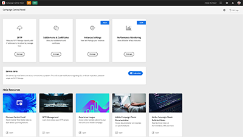

# Adobe Campaign Standard – 概觀

Adobe Campaign提供設計跨管道客戶體驗的平台，並提供視覺化行銷活動策劃、即時互動管理和跨管道執行的環境。 本使用手冊包含了有關 Adobe Campaign Standard 許多功能的影片和教學課程。

## 新增功能

* **[控制面板 — 監視工作流程](https://experienceleague.adobe.com/docs/control-panel-learn/tutorials/performance-monitoring/monitor-workflows.html?lang=en){target=&quot;_blank&quot;}**

   *瞭解如何監視工作流程的臨時儲存使用情況以及在何處編輯工作流程設定以避免執行個體出現資料庫或工作流程問題。*

* **[控制面板 — 監視輸送量和延時](https://experienceleague.adobe.com/docs/control-panel-learn/tutorials/performance-monitoring/monitor-throughputs-and-latency.html?lang=en){target=&quot;_blank&quot;}**

   *瞭解如何監視行銷活動執行個體的傳遞輸送量和異動訊息延時。*

## 員工精選

<table>
<tr>
  <td>
    
    

      <a href="./communication-channels/email/profile-substitution.md">
    <strong>設定檔替代 - 使用目標設定檔測試電子郵件訊息（影片）</strong>
    </a>
    

    

    <em>瞭解如何以設定檔將收到的同一個訊息呈現來傳送校樣，以供檢視。</em>
    

  </td>
   <td>
    
    

    <a href="https://experienceleague.adobe.com/docs/control-panel-learn/tutorials/control-panel-overview.html?lang=en">    <strong>控制面板（影片）</strong>
    </a>
    

    

    <em> 使用「控制面板」管理執行個體的設定和追蹤使用方式，以提高管理員的效率。</em>
    

  </td>
  <td>
    
    

      <a href="https://experienceleague.adobe.com/docs/campaign-standard-learn/getting-started-with-push-notifications-android/introduction.html?lang=en">
    <strong>教學課程：Android™ 推播通知快速入門</strong>
    </a>
    

    

    <em>本教學課程將逐步帶您瞭解從 Adobe Campaign 傳送推送通知以及在 Android™ 應用程式接收這些通知的相關步驟。</em>
    

  </td>
</tr>
</table>

## 其他資源

* [文件](https://experienceleague.adobe.com/docs/campaign-standard/using/campaign-standard-home.html?lang=zh-Hant)
