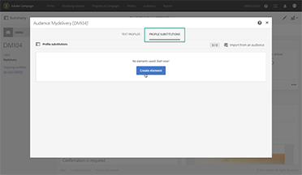

# Adobe Campaign Standard – 概觀

Adobe Campaign 為跨通路客戶體驗的設計提供了平台，並為可視性行銷活動的策劃、即時互動管理和跨通路執行提供了環境。本使用手冊包含了有關 Adobe Campaign Standard 許多功能的影片和教學課程。

## 新增功能

* **[監控資料庫](/help/control-panel-tutorials/performance-monitoring/monitoring-databases.md)**

   *瞭解如何監控執行個體的資料庫使用情況。*

* **[使用 CNAME 委派子網域](/help/control-panel-tutorials/subdomains-and-certificates/delegating-subdomains-using-cname.md)**

   *瞭解如何使用「控制面板」中的 CNAME 來設定和提交子網域。*

## 員工精選

<table>
<tr>
  <td>
    
    

      <a href="./communication-channels/email/profile-substitution.md">
    <strong>設定檔替代 - 使用目標設定檔測試電子郵件訊息（影片）</strong>
    </a>
    

    

    <em>瞭解如何以設定檔將收到的完全相同的訊息呈現，來傳送校樣，以供檢視。</em>
    

  </td>
   <td>
    
    

    <a href="https://docs.adobe.com/content/help/zh-Hant/campaign-standard-learn/control-panel/control-panel-overview.html">    <strong>控制面板（影片）</strong>
    </a>
    

    

    <em> 使用「控制面板」管理執行個體的設定和追蹤使用方式，以提高管理員的效率。</em>
    

  </td>
  <td>
    
    

      <a href="https://docs.adobe.com/content/help/zh-Hant/campaign-standard-learn/getting-started-with-push-notifications-android/introduction.html">
    <strong>教學課程：Android 推播通知快速入門</strong>
    </a>
    

    

    <em>本教學課程將逐步帶您瞭解從 Adobe Campaign 傳送推播通知以及在 Android 應用程式接收這些通知的相關步驟。</em>
    

  </td>
</tr>
</table>

## 其他資源

* [文件](https://docs.adobe.com/content/help/zh-Hant/campaign-standard/using/campaign-standard-home.html)
