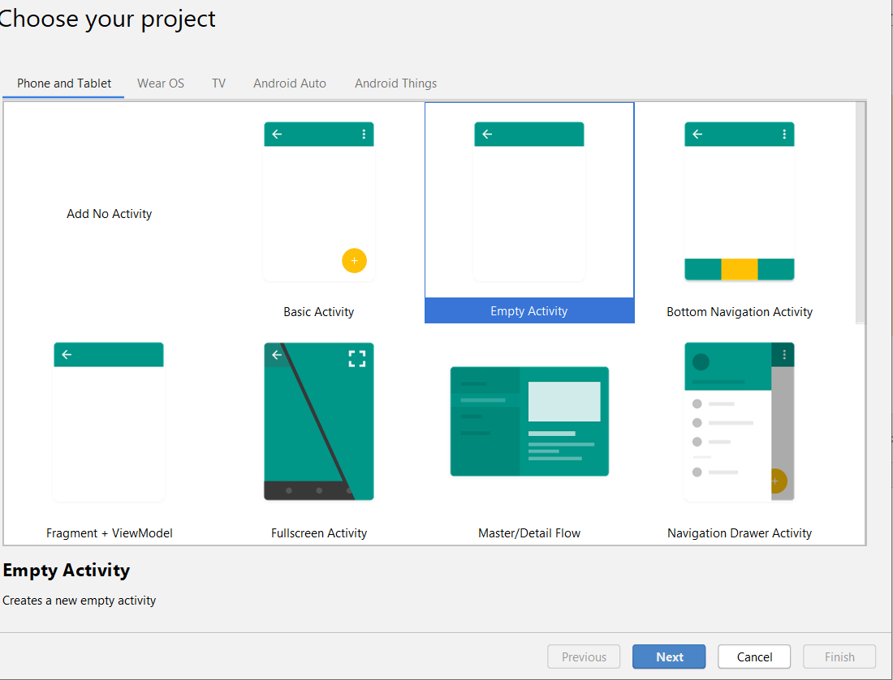
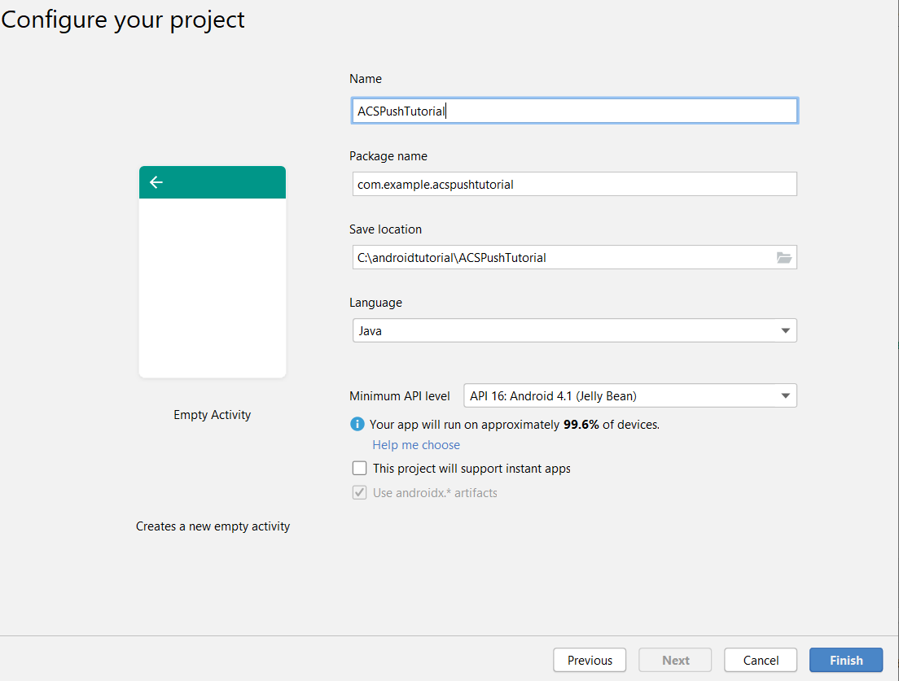
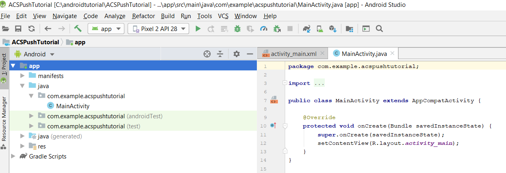
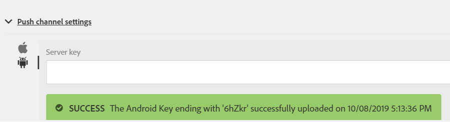

# 步驟1 — 建立 [!DNL Android] 應用程式和設定以使用 [!DNL Firebase Cloud Messaging]

在此部分中，您將建立 [!DNL Android] 要接收的應用程式 [!UICONTROL Push notifications] 從Adobe Campaign Standard傳送。 若要接收推播通知，應用程式必須向Google註冊 [!DNL Firebase Cloud Service].

1. 登入您的 [!DNL Firebase] 帳戶。

   [!DNL Firebase] 是Google的行動平台，可協助您快速開發高品質的應用程式。 如果您沒有 [!DNL Firebase] 帳戶，請建立一個 [從這裡](https://firebase.google.com).

2. 啟動 [!DNL Android Studio]
3. 按一下 **[!UICONTROL File]** > **[!UICONTROL New]** > **[!UICONTROL New Project].**
4. 選取 **[!UICONTROL Empty Activity]** 並按一下 **[!UICONTROL Next]。**

   

5. 為專案提供有意義的名稱。

   為了進行此示範，我們將專案命名為 *[!DNL ACSPushTutorial]*

   

6. 接受預設封裝名稱，然後按一下 **[!DNL Finish]** 以建立您的專案。
7. 您的專案結構看起來應該類似下列熒幕擷取畫面

   

8. 按一下 **[!UICONTROL Tools]** > **[!UICONTROL Firebase].** (這會將專案新增至 [!DNL Firebase])
9. 按一下&#x200B;**[!UICONTROL Set up Firebase Cloud Messaging]。**

   

10. 按一下&#x200B;**[!UICONTROL Connect to Firebase]。**
11. 將應用程式連線至Firebase後，請按一下 **[!UICONTROL Add FCM to your app].**
12. 按一下&#x200B;**[!UICONTROL Accept Changes]。**

   將FCM新增至應用程式時，精靈需要您的許可權才能對專案進行某些變更。

   ![[!DNL add-fcm-to-your-app]](assets/firebase-add-fcm-to-app.PNG)

應用程式與Firebase成功整合後，您應會收到如下所示的訊息：

![[!DNL fcm-successfull]](assets/android-firebase-success.PNG)

[請確認您的專案已列於 [!DNL Firebase ]主控台](https://console.firebase.google.com/)

## 設定 [!UICONTROL Push Channel] 設定

1. 登入 [!DNL Firebase] 主控台
2. 開啟 **[!UICONTROL ACSPushTutorial]** 專案。
3. 按一下 **齒輪圖示** 並開啟專案設定

   

4. 按Tab鍵前往 **[!UICONTROL Cloud Messaging]** 標籤。
5. 複製伺服器金鑰

   

6. 登入Adobe Campaign Standard執行個體
7. 按一下 **[!UICONTROL Adobe Campaign]** > **[!UICONTROL Administration]** > **[!UICONTROL Channels]** > **[!UICONTROL Mobile App].**
8. 選取適當的 **[!UICONTROL Mobile Application Property].**
9. 按一下 **[!DNL Android]圖示** 在 **[!UICONTROL Push Channel settings]** 區段。
10. 在伺服器金鑰欄位中貼上伺服器金鑰。

如果一切順利，您應該會看到SUCCESS訊息。

總而言之，我們已建立 [!DNL Android App] 並連線 [!DNL Android App] 替換為 [!DNL Firebase]. 接著，我們在Adobe Campaign中使用以下裝置連線行動應用程式： [!DNL Android App] 藉由貼上 [!DNL Android] 在Adobe Campaign Standard中連線至行動應用程式的應用程式伺服器金鑰。
