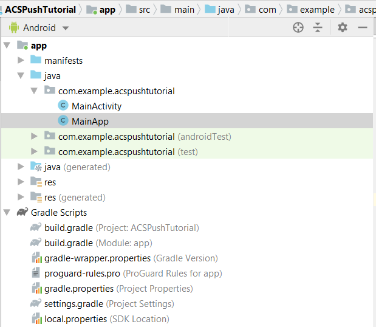
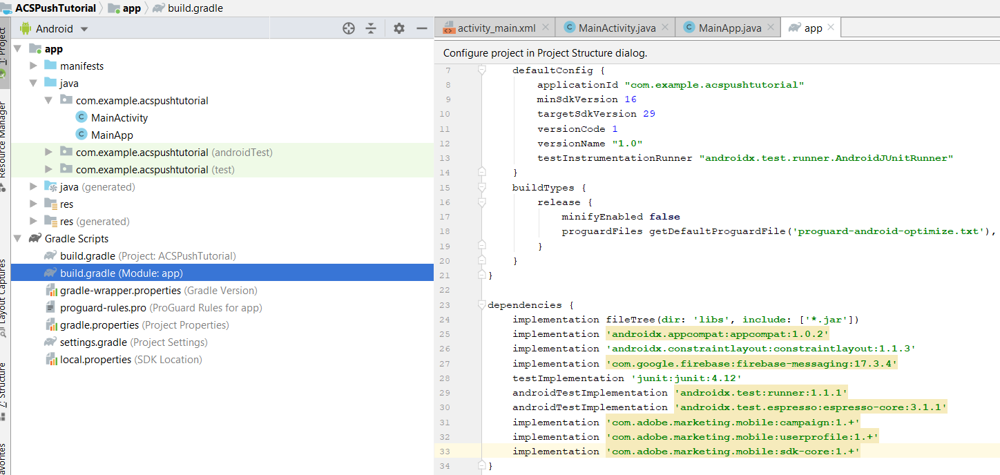

# 第2步 — 整合 [!UICONTROL Mobile SDK] 使用Android應用程式

在本節中，我們將整合 [!DNL Android] 應用程式搭配 [!UICONTROL Mobile SDK]. 若要整合 [!UICONTROL mobile SDK] 使用 [!DNL Android] 請依照下列步驟進行：

* 開啟 *ACSPushTutorial* 中的專案 [!DNL Android Studio]
* 建立名為的新Java類別 *MainApp* 會延伸 [!DNL android.app.Application]
* 此時您的專案結構應如下所示



* 展開 [!DNL Gradle Scripts] 資料夾。 按兩下 [!DNL build.gradle] 模組的。 將下列相依性貼到中的相依性區段 [!DNL build.gradle] 檔案。 您的 [!DNL build.gradle] 檔案現在看起來應該如下所示

<!--
Removed `{.line-numbers}` below
-->

```java
implementation 'com.adobe.marketing.mobile:campaign:1.+'
implementation 'com.adobe.marketing.mobile:userprofile:1.+'
implementation 'com.adobe.marketing.mobile:sdk-core:1.+'
```



* 同步您的 [!DNL Android] 按一下「立即同步」按鈕以同步處理您的專案

## 修改 [!DNL AndroidManifest.xml]{#modify-android-manifest}

開啟 *AndroidManifest.xml* 並將下列2行貼在資訊清單元素之後、應用程式元素之前。 這可讓您的應用程式與外部世界通訊

<!--
Removed `{.line-numbers}` below
-->

```xml
<uses-permission android:name="android.permission.INTERNET" />
<uses-permission android:name="android.permission.ACCESS_NETWORK_STATE" />
```

複製應用程式元素中的下列行
[!DNL android:name=".MainApp"]
儲存您的 [!DNL AndroidManifest.xml]
您的 [!DNL AndroidManifest.xml] 應該如下所示

<!--
Removed `{.line-numbers}` below
-->

```xml
<?xml version="1.0" encoding="utf-8"?>
<manifest xmlns:android="http://schemas.android.com/apk/res/android"
    package="com.example.acspushtutorial">
    <uses-permission android:name="android.permission.INTERNET" />
    <uses-permission android:name="android.permission.ACCESS_NETWORK_STATE" />

<application
    android:name=".MainApp"
    android:allowBackup="true"
    android:icon="@mipmap/ic_launcher"
    android:label="@string/app_name"
    android:roundIcon="@mipmap/ic_launcher_round"
    android:supportsRtl="true"
    android:theme="@style/AppTheme">

<activity android:name=".MainActivity">
<intent-filter>
    <action android:name="android.intent.action.MAIN" />
    <category android:name="android.intent.category.LAUNCHER" />
</intent-filter>
</activity>
</application>

</manifest>
```
