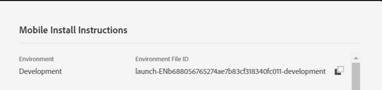

# 步驟 3－在您的行動應用程式中註冊擴充功能

在本部分，我們將新增程式碼，以註冊「使用者設定檔」、「身分」、「生命週期」和「訊號」擴充功能。 這些擴充功能是 [[!UICONTROL Mobile Core Extensions]](https://aep-sdks.gitbook.io/docs/using-mobile-extensions/mobile-core). 我們也需如下列程式碼中所示，註冊Adobe Campaign Standard擴充功能。

在 [!DNL Android] 工作室。 刪除MainApp中的整個代碼 **除了第一行，它是您的包語句**.

將下列程式碼貼入MainApp

<!--
Removed `{.line-numbers}` below
-->

```java
import [!DNL android].app.Application;
import android.util.Log;

import com.adobe.marketing.mobile.AdobeCallback;
import com.adobe.marketing.mobile.Campaign;
import com.adobe.marketing.mobile.Identity;
import com.adobe.marketing.mobile.InvalidInitException;
import com.adobe.marketing.mobile.Lifecycle;
import com.adobe.marketing.mobile.LoggingMode;
import com.adobe.marketing.mobile.MobileCore;
import com.adobe.marketing.mobile.Signal;
import com.adobe.marketing.mobile.UserProfile;

public class MainApp extends Application {

@Override
public void onCreate() {
super.onCreate();

MobileCore.setApplication(this);
MobileCore.setLogLevel(LoggingMode.DEBUG);

try{
    Campaign.registerExtension();
    UserProfile.registerExtension();
    Identity.registerExtension();
    Lifecycle.registerExtension();
    Signal.registerExtension();
    MobileCore.start(new AdobeCallback () {
        @Override
        public void call(Object o) {
            MobileCore.configureWithAppID("copy your launch property id here");
        }
    });
} catch (InvalidInitException e) {
    Log.d("ACS Exception", "exception");
}
}
}
```

第32行[!UICONTROL  Launch] 屬性的環境檔案ID。 這可從 [!UICONTROL environment tab] 您的 [!UICONTROL Launch] 屬性。


